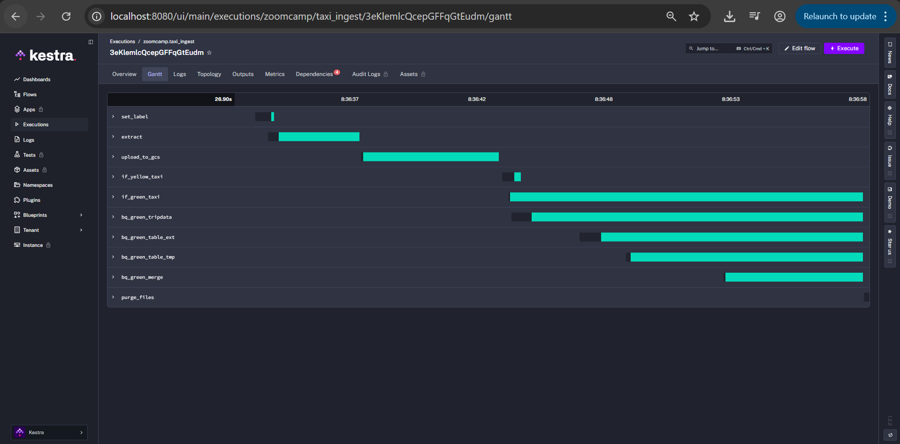
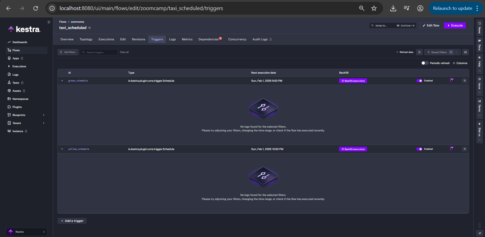
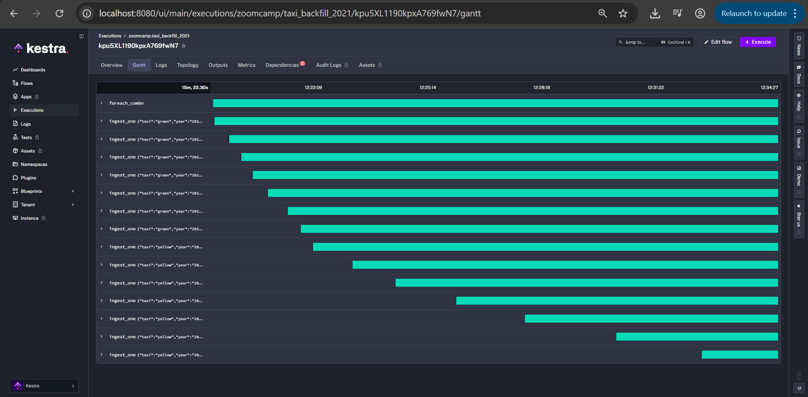
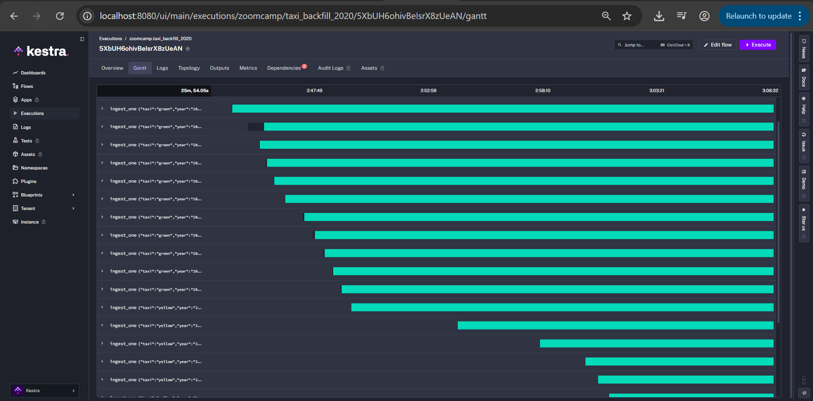
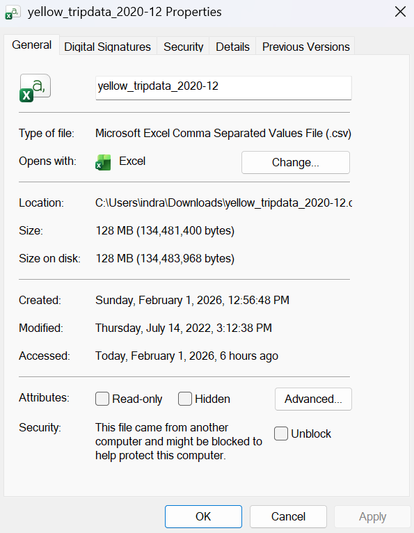
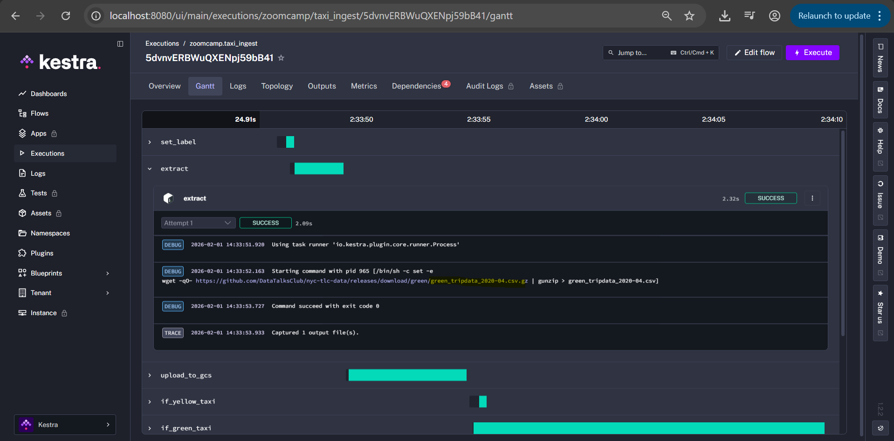
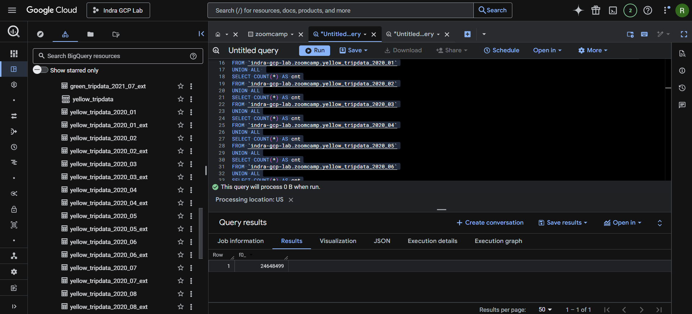
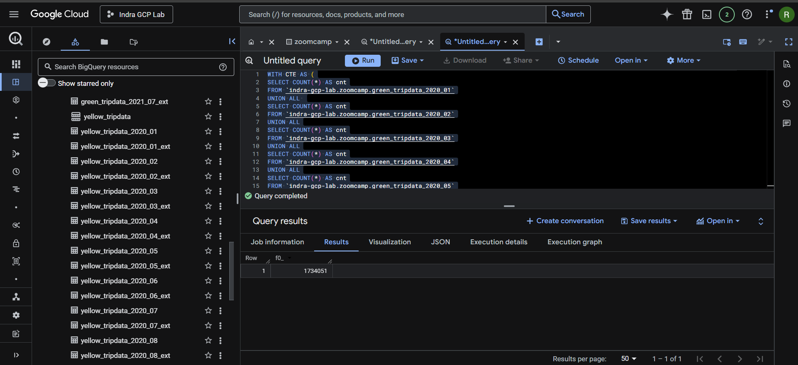

# DE Zoomcamp - Module 2 Homework (Kestra + GCP)

This repo contains Kestra flows to ingest NYC TLC **green** and **yellow** taxi CSVs (DataTalksClub releases) into **GCS** and **BigQuery**.

**Official homework reference (DE Zoomcamp 2026, Module 2):**

- https://github.com/DataTalksClub/data-engineering-zoomcamp/blob/main/cohorts/2026/02-workflow-orchestration/homework.md

## Quick Start (what to do)

1. Start Kestra locally with Docker (Section 1.1)
2. Import flows (Section 2)
3. Set KV values in Kestra (GCP creds + project/dataset/bucket)
4. Run one smoke test execution of `zoomcamp.taxi_ingest`
5. Load required 2021 data (Jan–Jul) for green + yellow
6. Load 2020 data (for quiz Q3/Q4)
7. Run BigQuery SQL for quiz answers
8. Push this repo to GitHub and submit the link

## 1) Prereqs

- Docker Desktop (Windows)
- A running Kestra instance (this repo includes a local Docker setup)
- A GCP project with:
  - A GCS bucket
  - A BigQuery dataset
  - A service account JSON with permissions for GCS + BigQuery

## 1.1) Start Kestra locally (Docker)

This repo includes a ready-to-run [docker-compose.yml](docker-compose.yml) with:

- Kestra UI/API on `http://localhost:8080`
- Postgres for Kestra’s internal DB

Steps (Windows):

1. Install and start Docker Desktop
2. Open PowerShell in the repo folder
3. Start Kestra:

   - `docker compose up -d`

4. Open Kestra UI: `http://localhost:8080`

To stop:

- `docker compose down`

In Kestra, set these **KV** values (KV Store):

- `GCP_CREDS` (service account JSON)
- `GCP_PROJECT_ID`
- `GCP_LOCATION`
- `GCP_BUCKET_NAME`
- `GCP_DATASET`

Where to set them:

- **Namespaces → zoomcamp → KV Store**

Important: `GCP_CREDS` must be the full service account JSON content (not a file path).

Security note: never commit your service account JSON to git. If you accidentally shared it (e.g., screenshot/clipboard), revoke/delete the key in GCP and create a new one.

## 2) Import flows

Import the YAMLs from the `flows/` directory:

- `flows/taxi_ingest.yaml`
- `flows/taxi_scheduled.yaml`
- `flows/taxi_backfill_2021.yaml` (optional convenience)
- `flows/taxi_backfill_2020.yaml` (optional convenience for Q3/Q4)

## 2.1) Smoke test (recommended)

Run a single month first to confirm everything works:

1. Flow: `zoomcamp.taxi_ingest`
2. Execute with inputs:
   - taxi: `green`
   - year: `2021`
   - month: `01`

Expected result: all tasks succeed (extract → upload_to_gcs → BigQuery tasks).



## 3) How to load 2021 data (required)

You must ingest **2021-01 through 2021-07** for **both green and yellow**.

### Option A (recommended): Kestra Schedule Backfill

1. Open flow `zoomcamp.taxi_scheduled`
2. Open **Triggers**
3. For **green_schedule**:
   - Click **Backfill**
   - Select start `2021-01-01` and end `2021-07-31`
   - Run backfill
4. Repeat for **yellow_schedule** (same period)

Because `taxi_scheduled` passes `trigger.date` into `taxi_ingest`, each backfill execution loads the matching `YYYY-MM` file.



### Option B: Run a loop flow (ForEach + Subflow)

1. Open flow `zoomcamp.taxi_backfill_2021`
2. Click **Execute**
3. This runs `taxi_ingest` for:
   - all (taxi, month) combos for 2021-01..2021-07

Note: this flow is implemented to work across Kestra versions where `taskrun.value` may be a JSON string.



## 3.1) How to load 2020 data (for quiz Q3/Q4)

To answer Q3 and Q4 you need the full 2020 data loaded.

Easiest way:

1. Import and execute [flows/taxi_backfill_2020.yaml](flows/taxi_backfill_2020.yaml)
2. Wait for all executions to finish (green 12 months + yellow 12 months)

Alternative: backfill triggers in [flows/taxi_scheduled.yaml](flows/taxi_scheduled.yaml) from `2020-01-01` to `2020-12-31` for both green and yellow.



### Option C: Manual execution (14 runs)

Run `zoomcamp.taxi_ingest` manually for each month:

- taxi = `green`, year=`2021`, month=`01`..`07`
- taxi = `yellow`, year=`2021`, month=`01`..`07`

## 4) How to answer the quiz questions (no guessing)

### Q1: Uncompressed file size for Yellow 2020-12

1. Execute `zoomcamp.taxi_ingest` with:
   - taxi=`yellow`, year=`2020`, month=`12`
2. Open the execution details
3. Open task `extract`
4. Look at the output file `yellow_tripdata_2020-12.csv` and note its **size**.

Pick the quiz option matching that size.



### Q2: Rendered value of variable `file` (green, 2020-04)

In this repo, `file` is defined in `zoomcamp.taxi_ingest` as:

- `{{inputs.taxi}}_tripdata_{{inputs.year}}-{{inputs.month}}.csv`

So for taxi=`green`, year=`2020`, month=`04` it renders to:

- `green_tripdata_2020-04.csv`



### Q3: Row count for Yellow taxi (all 2020 CSVs)

In BigQuery, run:

```sql
WITH CTE AS (
   SELECT COUNT(*) AS cnt
   FROM `indra-gcp-lab.zoomcamp.yellow_tripdata_2020_01`
   UNION ALL 
   SELECT COUNT(*) AS cnt
   FROM `indra-gcp-lab.zoomcamp.yellow_tripdata_2020_02`
   UNION ALL
   SELECT COUNT(*) AS cnt
   FROM `indra-gcp-lab.zoomcamp.yellow_tripdata_2020_03`
   UNION ALL
   SELECT COUNT(*) AS cnt
   FROM `indra-gcp-lab.zoomcamp.yellow_tripdata_2020_04`
   UNION ALL
   SELECT COUNT(*) AS cnt
   FROM `indra-gcp-lab.zoomcamp.yellow_tripdata_2020_05`
   UNION ALL
   SELECT COUNT(*) AS cnt
   FROM `indra-gcp-lab.zoomcamp.yellow_tripdata_2020_06`
   UNION ALL
   SELECT COUNT(*) AS cnt
   FROM `indra-gcp-lab.zoomcamp.yellow_tripdata_2020_07`
   UNION ALL
   SELECT COUNT(*) AS cnt
   FROM `indra-gcp-lab.zoomcamp.yellow_tripdata_2020_08`
   UNION ALL
   SELECT COUNT(*) AS cnt
   FROM `indra-gcp-lab.zoomcamp.yellow_tripdata_2020_09`
   UNION ALL
   SELECT COUNT(*) AS cnt
   FROM `indra-gcp-lab.zoomcamp.yellow_tripdata_2020_10`
   UNION ALL
   SELECT COUNT(*) AS cnt
   FROM `indra-gcp-lab.zoomcamp.yellow_tripdata_2020_11`
   UNION ALL
   SELECT COUNT(*) AS cnt
   FROM `indra-gcp-lab.zoomcamp.yellow_tripdata_2020_12`
)
   SELECT SUM(cnt) AS cnt FROM CTE;
```

Choose the quiz option that equals `cnt`.



### Q4: Row count for Green taxi (all 2020 CSVs)

In BigQuery, run:

```sql
WITH CTE AS (
   SELECT COUNT(*) AS cnt
   FROM `indra-gcp-lab.zoomcamp.green_tripdata_2020_01`
   UNION ALL 
   SELECT COUNT(*) AS cnt
   FROM `indra-gcp-lab.zoomcamp.green_tripdata_2020_02`
   UNION ALL
   SELECT COUNT(*) AS cnt
   FROM `indra-gcp-lab.zoomcamp.green_tripdata_2020_03`
   UNION ALL
   SELECT COUNT(*) AS cnt
   FROM `indra-gcp-lab.zoomcamp.green_tripdata_2020_04`
   UNION ALL
   SELECT COUNT(*) AS cnt
   FROM `indra-gcp-lab.zoomcamp.green_tripdata_2020_05`
   UNION ALL
   SELECT COUNT(*) AS cnt
   FROM `indra-gcp-lab.zoomcamp.green_tripdata_2020_06`
   UNION ALL
   SELECT COUNT(*) AS cnt
   FROM `indra-gcp-lab.zoomcamp.green_tripdata_2020_07`
   UNION ALL
   SELECT COUNT(*) AS cnt
   FROM `indra-gcp-lab.zoomcamp.green_tripdata_2020_08`
   UNION ALL
   SELECT COUNT(*) AS cnt
   FROM `indra-gcp-lab.zoomcamp.green_tripdata_2020_09`
   UNION ALL
   SELECT COUNT(*) AS cnt
   FROM `indra-gcp-lab.zoomcamp.green_tripdata_2020_10`
   UNION ALL
   SELECT COUNT(*) AS cnt
   FROM `indra-gcp-lab.zoomcamp.green_tripdata_2020_11`
   UNION ALL
   SELECT COUNT(*) AS cnt
   FROM `indra-gcp-lab.zoomcamp.green_tripdata_2020_12`
)
SELECT SUM(cnt) AS cnt FROM CTE;
```

Choose the quiz option that equals `cnt`.



### Q5: Row count for Yellow taxi March 2021

In BigQuery, run:

```sql
SELECT COUNT(*) AS cnt
FROM `indra-gcp-lab.zoomcamp.yellow_tripdata`
WHERE DATE(tpep_pickup_datetime) >= '2021-03-01'
  AND DATE(tpep_pickup_datetime) <  '2021-04-01';
```

Choose the quiz option that equals `cnt`.


### Q6: Timezone in a Schedule trigger

Use the IANA timezone name:

```yaml
timezone: America/New_York
```

So the correct quiz option is: **Add a timezone property set to America/New_York in the Schedule trigger configuration**.
